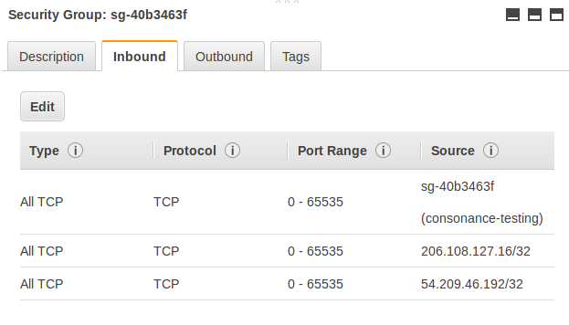

## Prereqs

Install [docker-compose](https://docs.docker.com/compose/install/) on a Ubuntu 16.04+ VM and it's dependencies.

**NOTE:** This project is fairly DIY, read all the directions below before running.

**NOTE:** We currently test on AWS. We recommend working through the [EC2 tutorial](https://docs.aws.amazon.com/AWSEC2/latest/UserGuide/concepts.html) if you have not already.

Consonance uses cwltool and schema-salad on provisioned worker nodes to launch and run CWL. 
Version numbers currently live in the Ansible playbook used to deploy workers.

## Usage

Before you run the `install_bootstrap` script, you will want to create a SSH key used to secure communication with the 
launcher. You will also need a security group that defines the rules for your launcher and the worker nodes that it 
creates. Generally, you will need at least three rules. 
 
A screen shot follows with example security group rules:
 

The first row indicates that that hosts in a security group should be able to access other hosts in the group using private 
ip addresses. The second row indicates that all ports are accessible from your own ip address (206.108.127.16 in this example)
for trouble-shooting. Lastly, the third row is due to a quirk with the current version of Consonance. It indicates that 
the public ip address of the launcher (54.209.46.192 in this example) is whitelisted for access to hosts in the security group.

First, start a VM on AWS to function as your launcher. 

Login and setup the prerequities above. To run the webservice and command-line tools, download the script and run it (the script will download templates and
fill them in in the working directory)

    wget https://github.com/Consonance/consonance/releases/download/2.0.0-alpha.13/consonance
    bash install_bootstrap

You can exit and re-enter via:

    exit
    docker-compose run client

**NOTE:** The Bash install\_bootstrap script is tested on Ubuntu 16.04 but sets up the templates required to run `docker-compose up` on other OSes if needed.

You are now ready to submit some work (from within the admin docker container).  I suggest you use the `bamstats` Dockstore tool for testing purposes.  See:

* [Dockstore.cwl](https://github.com/briandoconnor/dockstore-tool-bamstats/blob/develop/Dockstore.cwl)
* [sample\_configs.json](https://github.com/briandoconnor/dockstore-tool-bamstats/blob/develop/sample_configs.json)

The following command submits a job and requests a m1.xlarge for it to run on: 

    consonance run  --flavour m1.xlarge --image-descriptor Dockstore.cwl --run-descriptor sample_configs.json

The following command checks the status of a job:

    consonance status --job_uuid 37180f53-e8e1-4079-bf39-89c9bfc8d79c

After scheduling a job, you will see a worker VM be requested, Ansible will be run to setup 
these workers, and then they will pull a job from a queue, and report the results back 
to the launcher. 

## Debugging

For debugging, there are a number of other resources for more advanced debugging (substitute your launcher's ip address)

1. You can access the swagger interface for the Consonance web service at the following 
[http://54.174.247.47:8080/static/swagger-ui/index.html](http://54.174.247.47:8080/static/swagger-ui/index.html)
2. You can access the rabbitmq management console here [http://54.174.247.47:15672/](http://54.174.247.47:15672/) 
 with a default username and password of guest/guest
3. In the client environment, you have access to the consonance database by calling commands like `psql postgres -c "\d+"`
4. You can use `docker ps -a` to list active containers and then commands like `docker exec -ti <container id> /bin/bash` 
to examine the environment within the containers. 
5. Versions of Consonance, the script/templates, and the Ansible playbook for setting up 
workers are set at the beginning of the [install_bootstrap](install_bootstrap)

Lastly, it can be worthwhile looking at the log directory (`/consonance_logs`) which collects logs from the Consonance 
webservice, provisioner, and coordinators.

## FAQ

* How do I change versions of Consonance or its dependencies that are used? 
Versions are specified at the beginning of the `install_bootstrap` script and are templated out to the relevant files
* Can I stop and restart the underlying VM? 
An instance's private and public IP addresses are baked into the configuration of several services. 
For the time being, when restarting you will need to re-create your Docker compose instance.
