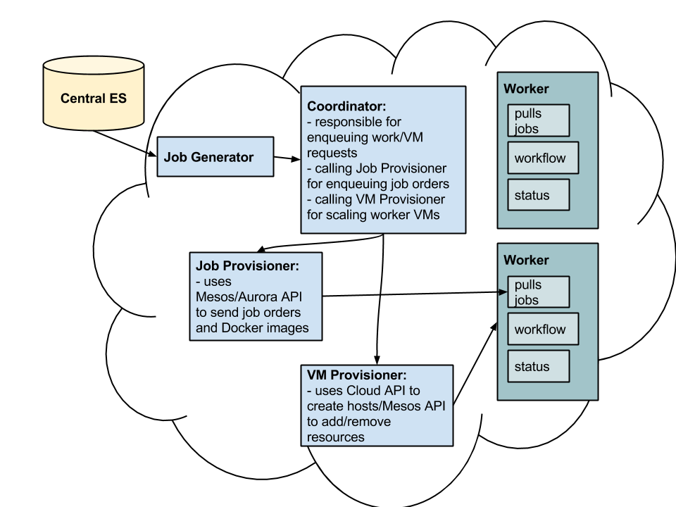
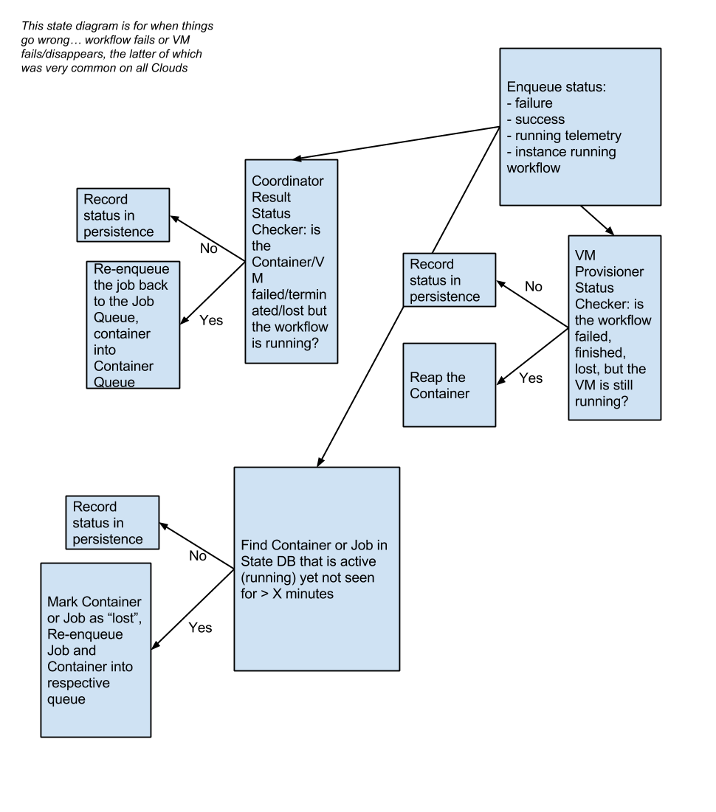
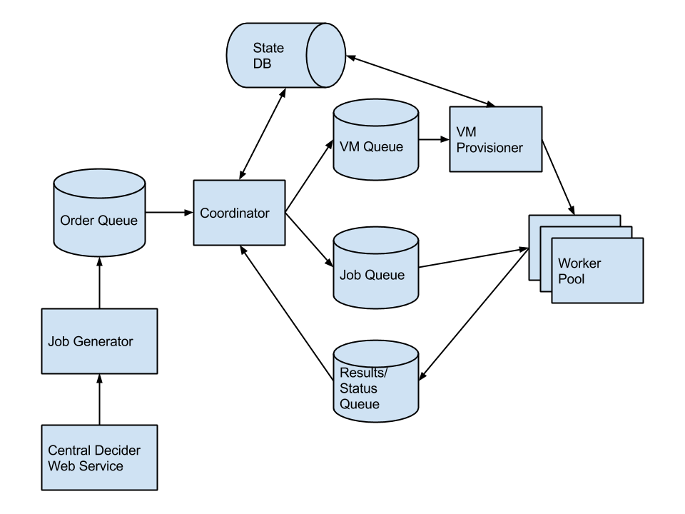

# PanCancer Architecture 3.0 Prototype

## About

The idea behind this architecture is described in more detail elsewhere but the basic idea is a lightweight
framework to run Docker containers for the PanCancer project.

## Building

Just a Java maven project so do the following:

    mvn clean install

## Dependencies

Eventually we will want everything in a single (or series) of Docker containers. This
will make it much easy to redistribute but, for the time being, these can be installed
on your development host directly.

I'm focused on development on a Mac using HomeBrew, you will need to setup
the dependencies using whatever system is appropriate for your environment.

### Log4J + Logstash

I'm trying to follow this guide for using Log4J so I can easily incorprate with LogStash in the future: [guide](https://blog.dylants.com/2013/08/27/java-logging-creating-indexing-monitoring/).

### RabbitMQ

See [install guide](https://www.rabbitmq.com/install-homebrew.html)

Basically you do:

    brew update
    brew install rabbitmq
    /usr/local/sbin/rabbitmq-server

And at that point the service is running.

### PostgreSQL

Install with Homebrew

    boconnor@odm-boconnor ~$ brew install postgresql

Now launch it:

    boconnor@odm-boconnor ~$ postgres -D /usr/local/var/postgres

Now create a user:

    # using 'queue' as the password by default
    boconnor@odm-boconnor ~$ createuser -P -s -e queue_user
    Enter password for new role:
    Enter it again:
    CREATE ROLE queue PASSWORD 'md5f8ceabb22d9297bd28382151f35a2252' SUPERUSER CREATEDB CREATEROLE INHERIT LOGIN;

Now create a DB:

    boconnor@odm-boconnor ~$ createdb queue_status

Setup a schema for the DB:

    boconnor@odm-boconnor pancancer-arch-3$ psql -h 127.0.0.1 -U queue_user -W queue_status < sql/schema.sql

Connect to the DB if you need to:

    boconnor@odm-boconnor ~$ psql -h 127.0.0.1 -U queue_user -W queue_status

Delete the contents if you want to reset:

    > delete from job; delete from provision;

Drop the DB if you need to clear it out:

    boconnor@odm-boconnor pancancer-arch-3$ dropdb queue_status
    boconnor@odm-boconnor ~$ createdb queue_status

## Testing

The following will let you test on a local box. This simulates a multiple machine/VM
setup on a single box just using Java and RabbitMQ.  Eventually, this will just
be one of multiple possible backends configured by the settings file. This single-machine,
pure Java running example will be used for integration and other tests.

### Job Generator

This generates job orders on an infinite loop.

    java -cp target/PanCancerArch3-1.0.0-SNAPSHOT.jar info.pancancer.arch3.jobGenerator.JobGenerator --config conf/config.json

### Coordinator

This consumes the jobs and prepares messages for the VM and Job Queues.

It then monitors the results queue to see when jobs fail or finish.

Finally, for failed or finished workflows, it informs the Container provisioner about finished
VMs that can be terminated.

    java -cp target/PanCancerArch3-1.0.0-SNAPSHOT.jar info.pancancer.arch3.coordinator.Coordinator --config conf/config.json

### Container Provisioner

    # java -cp target/PanCancerArch3-1.0.0-SNAPSHOT.jar info.pancancer.arch3.containerProvisioner.ContainerProvisioner --config conf/config.json

Now with threads:

    java -cp target/PanCancerArch3-1.0.0-SNAPSHOT.jar info.pancancer.arch3.containerProvisioner.ContainerProvisionerThreads --config conf/config.json

### Worker

    java -cp target/PanCancerArch3-1.0.0-SNAPSHOT.jar info.pancancer.arch3.worker.Worker --config conf/config.json

### Checking Results

Temp object for helping with debugging.

    java -cp target/PanCancerArch3-1.0.0-SNAPSHOT.jar info.pancancer.arch3.coordinator.CoordinatorResult --config conf/config.json

## Cleanup

To cleanup and delete all queues:

    for i in `/usr/local/sbin/rabbitmqadmin list queues name | grep -v name | awk '{print $2}'`; \
      do echo $i; \
      /usr/local/sbin/rabbitmqadmin delete queue name="$i"; \
      done;
    /usr/local/sbin/rabbitmqadmin list queues name

## Diagrams

## TODO

### Soon

* implement heartbeat
    * stderr/stdout
* try to model complex/non-standard events in the standalone daemons
    * job fails, 20% of the time
    * vm disappears... need to update the DB then re-enqueue the VM/Job request
    * longer-running jobs... longer than 10s
* Solomon wants a "workflow_path" added to the order
* figure out impl/extends class strategy for the various components so they can be  swapped out with different implementations -- TODO, Solomon?
    * worker threads
    * workers that fail, are successful, etc
    * flesh out worker to run docker and provide heartbeat, resources, etc
* finalize the message format between the layers, serializers -- DONE
* pick a storage mechanism for state used by the VMProvisioner and Coordinator -- DONE
* lifecycle of jobs -- DONE
    * enqueue, monitor, launch VMs, status, etc
    * see diagram
* need to add
    * error checking
    * improve logging
    * cleanup of messaging and DB handles

### Future

* utilities for clearing the status persistence storage and the message queues if you need to "start over"
* really great logging/reporting that's human readable
* ability to turn off the VMProvisioner in case a human makes the worker nodes
* log files loaded into the ELK stack for visualization
* Docker container for the system, integration with Architecture Setup 3.0
* need job queues with different names based on the workflow and version they target, this will make it easier to run multiple workflow types at the same time
